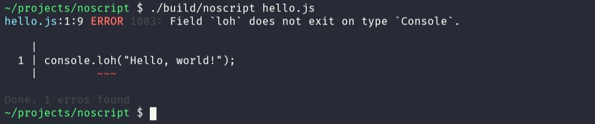

# NoScript

A fast and lightweight JavaScript static type checker

***Note***: This project still under active development so thing can change.

## Demo

- file: `hello.ts`
```javaScript
console.loh("Hello, world!");
```
output:


